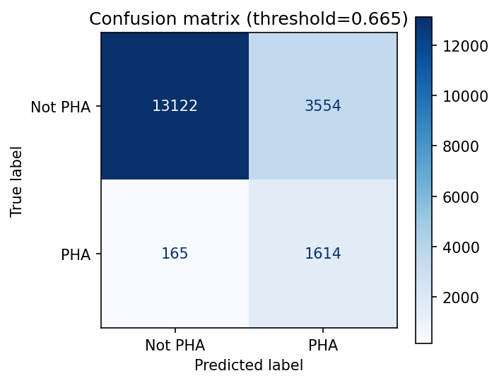
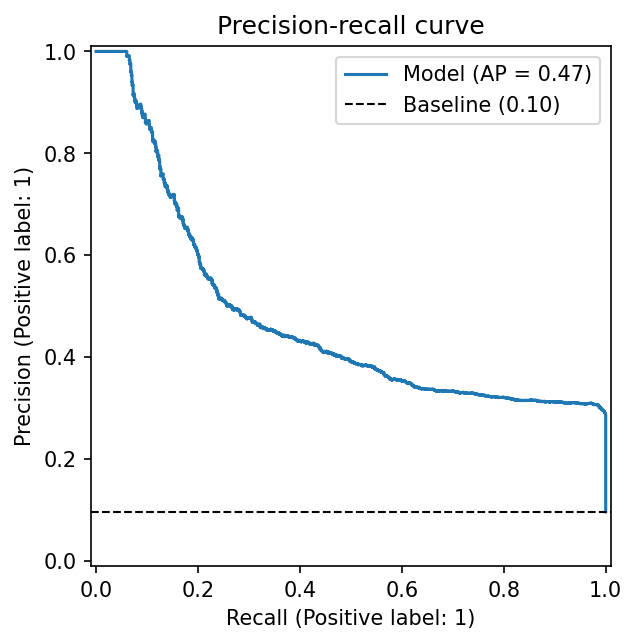
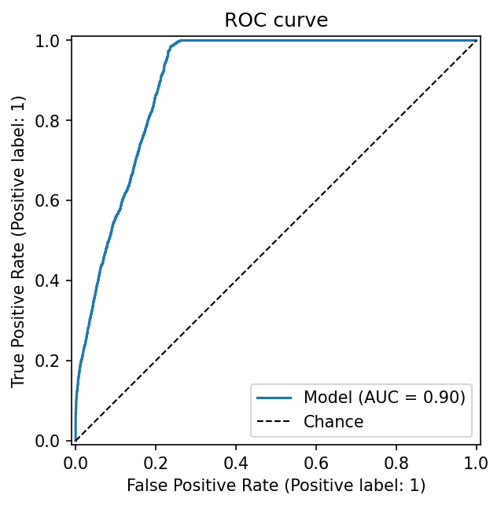
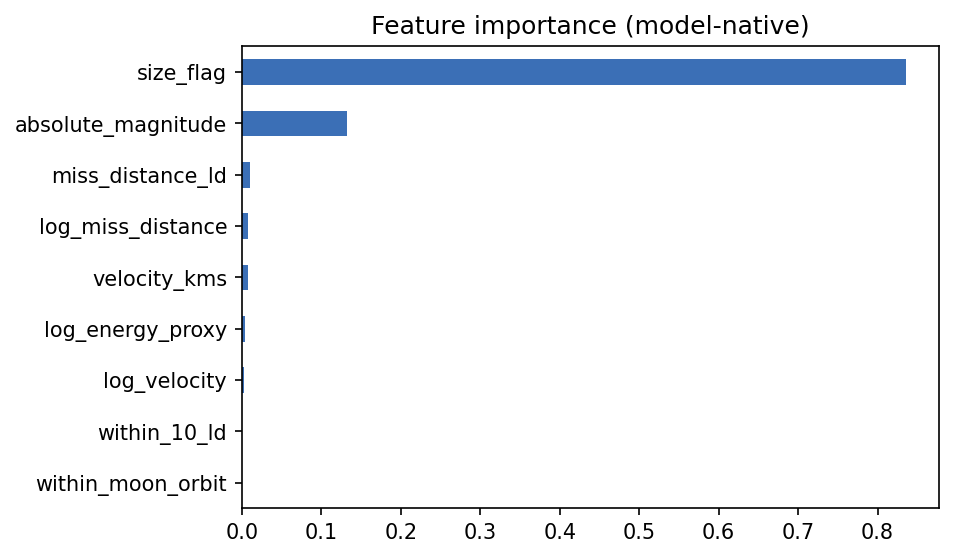
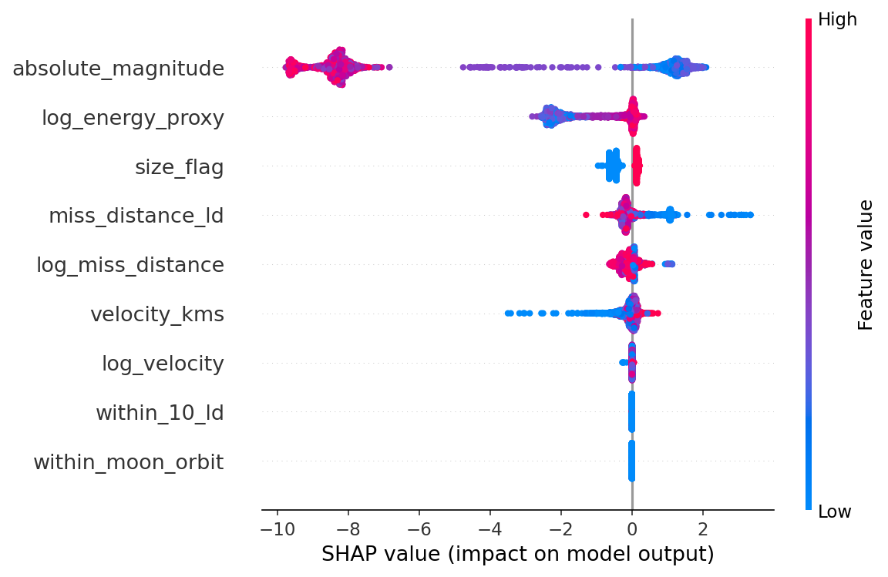
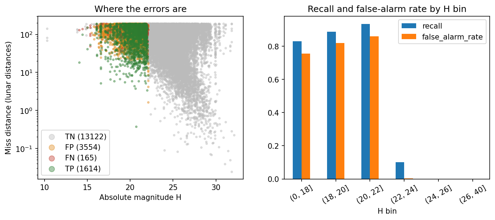

# ☄️ Asteroid Hazard Predictor

Predict whether a near-Earth asteroid close approach belongs to a **Potentially Hazardous Asteroid (PHA)**, using a leakage-aware, imbalance-aware ML pipeline, SHAP explanations and a Streamlit app. Everything runs locally with free tools.

## Problem statement
Given three numbers describing an asteroid close approach (absolute magnitude **H**, relative velocity, miss distance), classify it as hazardous or not. Missing a hazardous asteroid is far worse than a false alarm, so the decision threshold is tuned to prioritise **recall**.

## Dataset and the PHA definition
- Source: Kaggle ["NASA - Nearest Earth Objects"](https://www.kaggle.com/datasets/sameepvani/nasa-nearest-earth-objects) (`neo.csv`, 90,836 rows, derived from NASA/JPL data).
- **Each row is a close approach, not a unique asteroid**: 90,836 rows cover 27,423 asteroids. Splits and CV are therefore *grouped by asteroid* so the same asteroid never sits in both train and test.
- Class balance: 9.7% hazardous (8,840) vs 90.3% not (81,996).
- NASA defines a **PHA** as an asteroid whose orbit comes within **0.05 AU** of Earth's orbit (MOID ≤ 0.05 AU) **and** that is larger than about 140 m (absolute magnitude **H ≤ 22**).
- Columns `orbiting_body` / `sentry_object` are constant and dropped. `est_diameter_min/max` are an exact function of H (verified: log error 0.0000), so they add no information and are not used.

> **Deviation from the original brief:** the brief assumed JPL orbital elements (a, e, i, MOID…). The supplied dataset has none of these, so the project uses H + flyby velocity + miss distance. The a-vs-e plot is replaced by H-vs-miss-distance.

## The leakage insight (adapted)
PHA is *defined* by MOID and H. A dataset containing MOID would give near-perfect scores trivially (that is label leakage, not learning). This dataset contains **no MOID**, so that trivial shortcut is structurally absent, but H, the *other half* of the definition, is present and dominates. I therefore ran three experiments to show how much of the answer each piece gives:

| Experiment | Features | Test PR-AUC | ROC-AUC | Recall | Precision | F1 |
|---|---|---|---|---|---|---|
| **A: Full (main model)** | H + size/energy features + flyby | **0.474** | **0.903** | 0.907 | 0.312 | 0.465 |
| B: Flyby only (no H) | velocity, miss distance | 0.191 | 0.691 | 0.882 | 0.126 | 0.220 |
| C: H only | H, H ≤ 22 flag | 0.338 | 0.879 | 0.892 | 0.289 | 0.437 |

*Held-out test set: 18,455 rows / 5,484 asteroids, 9.6% positives (PR-AUC chance level ≈ 0.096). Recall/precision/F1 are at the tuned threshold (0.665 for A). All numbers come from [reports/metrics.json](reports/metrics.json).*

Reading the table: with no orbit information the ceiling is low. H alone gets most of the way (ROC-AUC 0.88); flyby kinematics alone are weak (0.69); combining them gives the best PR-AUC (0.47). The real missing ingredient is MOID/orbital elements, i.e. future work.

## Model comparison (5-fold stratified grouped CV on training data, experiment A)
| Model | Imbalance | PR-AUC | ROC-AUC | Recall@0.5 | Precision@0.5 |
|---|---|---|---|---|---|
| Logistic Regression (baseline) | class_weight | 0.479 | 0.904 | 0.986 | 0.310 |
| Logistic Regression | SMOTE | 0.479 | 0.904 | 0.985 | 0.310 |
| Random Forest | class_weight | 0.487 | 0.907 | 0.472 | 0.410 |
| Random Forest | SMOTE | 0.476 | 0.905 | 0.705 | 0.350 |
| **XGBoost** | **class_weight** | **0.492** | 0.909 | 0.923 | 0.324 |
| XGBoost | SMOTE | 0.482 | 0.907 | 0.855 | 0.329 |

- Best by PR-AUC: **XGBoost + class weights**, then tuned with `RandomizedSearchCV` (15 iterations, optimising PR-AUC): CV PR-AUC 0.492 → 0.503.
- class_weight ≥ SMOTE for every tree model here, and it is simpler/faster.
- Honest note: the logistic-regression baseline is only ~0.01 PR-AUC behind, because the signal is essentially one dominant feature (H). Model choice matters little; the information in the features is the limit.
- Preprocessing (feature engineering, median imputation + missing indicators, scaling) and SMOTE live **inside** the imblearn `Pipeline`, so every CV fold fits them on its own training portion only. (This data has no missing values; the imputer is in place for new inputs.)

## Why the threshold favours recall
A false alarm costs a follow-up observation; a missed hazardous asteroid could cost far more. The threshold is chosen from **out-of-fold training predictions** as the highest value that still reaches **≥ 90% recall** (the test set is never used to choose it). Result: test recall **0.907** (1,614 of 1,779 PHA rows caught) at precision **0.312**, i.e. roughly 2 false alarms per real catch. PR-AUC, not accuracy, is the headline metric because of the 90/10 imbalance.

## Figures
| | |
|---|---|
|  |  |
|  |  |
|  |  |

SHAP force plots: [true positive](reports/figures/shap_force_true_positive.png), [false negative](reports/figures/shap_force_false_negative.png).

## Error analysis (test set; full tables in [reports/error_analysis.md](reports/error_analysis.md))
- Counts: 1,614 TP, 165 FN, 3,554 FP, 13,122 TN.
- **Missed PHAs (FN)** look like the model's "average non-hazard" in flyby terms: median speed ~41,500 km/h (vs ~61,200 for caught PHAs) and a larger miss distance (~54.5M km vs ~38.9M). Their H is similar (≈20.3), so they are large rocks that happened to fly by slowly and far away.
- **False alarms (FP)** are large bright asteroids (median H ≈ 20.4) that are not PHAs: among rows with H ≤ 22, ~75-86% of non-PHAs are flagged. The model cannot tell them apart without the orbit (MOID).
- Almost all small asteroids (H > 22) are correctly rejected; a PHA is essentially impossible there (PHA share 0.2% for 22 < H ≤ 24).

## How to run
```bash
pip install -r requirements.txt          # Python 3.10+ (developed on 3.13)
# put neo.csv in data/raw/ (see src/fetch_data.py for the Kaggle link)
make fetch      # verify the data file
make clean      # data/processed/neo_clean.csv + class balance
make train      # compare, tune, save models/pha_model.joblib + reports/metrics.json (~10 min)
make evaluate   # figures + SHAP + error analysis in reports/
make app        # Streamlit app
make test       # pytest
```
Without `make`: `python -m src.train`, `python -m src.evaluate`, `streamlit run app/streamlit_app.py`. EDA: `notebooks/01_eda.ipynb`.

## Project structure
```
src/        config.py fetch_data.py clean.py features.py train.py evaluate.py
app/        streamlit_app.py     notebooks/ 01_eda.ipynb
tests/      test_clean.py test_model_smoke.py
models/     pha_model.joblib (pipeline + threshold)     reports/ metrics.json, figures/
```

## Limitations
- No MOID or orbital elements: the true PHA criterion cannot be learned, and precision tops out around 30%.
- Rows are close approaches, so per-asteroid conclusions are approximate. Labels are per asteroid but flyby features vary per approach, and test metrics are per row.
- Estimated sizes assume an albedo; H itself has uncertainty.
- The dataset is a Kaggle snapshot; "hazardous" labels may lag current NASA classifications.
- Educational project, not a planetary-defence tool.

## Future work
- Use JPL SBDB orbital elements (a, e, i, q, …) for the real task and move MOID into a proper leakage experiment (the original brief).
- Aggregate to one row per asteroid and calibrate the probabilities.
- Add an LLM layer that turns SHAP values into a plain-English explanation of each prediction.
